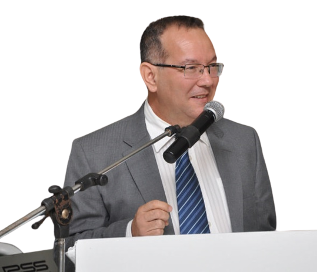

# Inteligência Artificial aplicada à Automação

Este é um material criado pelo [Professor Dr. Walter Augusto
Varela](https://www.linkedin.com/in/walter-augusto-varella), com o auxilio do graduando em Engenharia [Arthur Ramos Pereira](linkedin.com/in/ramosp-arthur). com o objetivo de oferecer aos alunos uma introdução sobre a disciplina de
Inteligência Artificial (IA) aplicada à Automação.

 

- [Aula 01 - Inteligência Artificial aplicada à
  Automação](https://github.com/kArthurs3010384/slides/blob/main/aula01/aula01.md)

- [Aula 02 - Características do
  Orange](https://github.com/kArthurs3010384/slides/blob/main/aula02/Aula_02.md)

- [Aula 03 - Algoritmos de
  busca](https://github.com/kArthurs3010384/slides/blob/main/aula03/Aula_03.md)

- [Aula 04 - Conceitos sobre Machine
  Learning](https://github.com/kArthurs3010384/slides/blob/main/aula04/Aula_04.md)

- [Aula 05 - Algoritmo genético -
  conceitos](https://github.com/kArthurs3010384/slides/blob/main/aula05/Aula05.md)

- [Aula 06 - Conceito de Machine Learning e
  TinyML](https://github.com/kArthurs3010384/slides/blob/main/aula07/Aula07.md)
