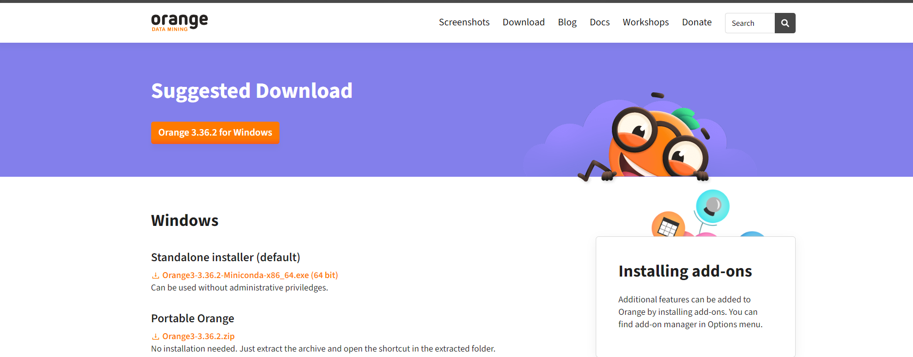
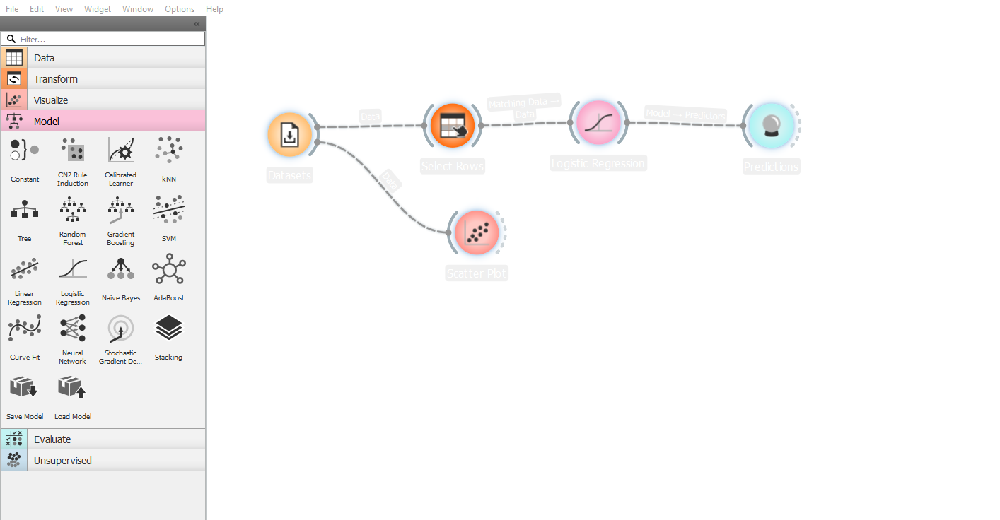

# Aula 02

# Aula 02

## Características do Orange

Ferramenta para Mineração de dados Forma divertida e produtiva de
Aprendizado de máquina de código aberto e visualização de dados. Pelo o
Orange é possível fazer projetos de Machine Learning de forma
simplificada sem escrever linhas de código.

Crie fluxos de trabalho de análise de dados visualmente, com ampla caixa
de ferramentas (os widgets). \## Obtendo o Orange Faça o Download
clicando [aqui](https://orangedatamining.com/download/)

## Características do Orange

### Data

### Transform

### Visualize

### Model

### Evaluete

### Unsurpevised

### Documentation

[Clique aqui para acessar a
documentação](https://orangedatamining.com/docs/)

[Clique aqui para acessar o canal no
YouTube](https://www.youtube.com/@OrangeDataMining)

