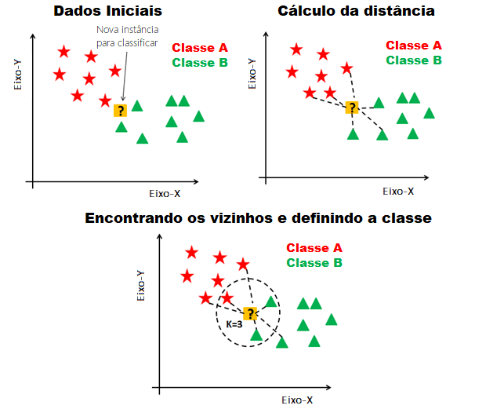
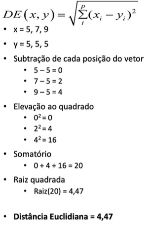

# Aula 04

# Aula 04

## Considerações iniciais

Nesta aula apresentamos os conceitos sobre Algoritmos de Classificação
utilizados em Aprendizado de Máquina (Machine Learning). Serão vistos os
algoritmos de Naïve Bayes, Árvores de decisão, Aprendizado por regras,
aprendizado por instâncias (kNN), aprendizado com máquinas de vetores de
suporte (SVM), e Regressão Logística.

## Conceitos sobre Machine Learning

 

  

Neste exemplo temos os dados dos clientes e sua classificação de risco,
o objetivo a partir desta tabela é classificar futuros clientes usando
Machine Learning.

- Note que os a coluna dos riscos é uma avaliação feita pelo banco

 

## Objetivo

- Treinar um algoritmo de Machine Learning
- Testar cada registro de cliente para que o algoritmo possa fazer a
  análise e classificar: Risco: Baixo, Moderado ou Alto

## Algoritmos Naive Bayes

Naive Bayes é um algoritmo que gera uma tabela de probabilidades a
partir de uma técnica de classificação de dados. É usado para o machine
learning, mas a técnica é famosa no meio acadêmico da estatística. Seu
racional é baseado nos estudos de Thomas Bayes e “naive” significa
ingênuo, uma referência a linha de análise do algoritmo para as
características da base de dados em questão.

Sua aplicação para classificação e geração de tabela de probabilidades.
Vale dizer que sua lógica assume que a presença de uma característica
específica não se relaciona com qualquer outro recurso também inserido
na base de dados analisada. + Exemplo: construção de uma campanha de
marketing focada em um lead ideal que teria que estar alinhado com o
preço, diferenciais do produto e canal de aquisição. Assim, todos esses
elementos, juntos, têm uma relação direta com a construção da campanha
mais eficiente para a conversão, mas, separadamente, também configuram
propriedades que contribuem para a probabilidade de encontrar o lead
ideal.

Isto permite fazer o aprendizado de máquina que contempla uma análise
com diferentes elementos de forma integrada, e também separadamente,
trazendo mais insights e informações para o gestor

## Treinamento

Aprendizagem: coloca os dados na tabela

- Coloca na tabela a quantidade de ocorrência de cada atributo
- Calcula as porcentagens de intersecção entre as colunas

## Análise de risco de um novo cliente

Dados:

| História | Dívida | Garantias |   Renda   |
|----------|:-------|----------:|:---------:|
| Boa      | Alta   |   Nenhuma | \> 35.000 |

$$
P(\text{Alto}) = \frac{6}{14} \cdot \frac{1}{6} \cdot \frac{4}{6} \cdot \frac{6}{6} \cdot \frac{1}{6}
$$

$$
P(\text{Alto}) = 0,0079
$$

$$
P(\text{Alto}) = (0,0079/ 0,0645) *100 = 12,24
$$  

$$
    P(\text{Moderado}) = \frac{3}{14} \cdot \frac{1}{3} \cdot \frac{1}{3} \cdot \frac{2}{3} \cdot \frac{1}{3}
$$ $$
    P(\text{Moderado}) = 0,0052
$$

$$
    P(\text{Moderado}) = (0,0052/ 0,0645)* 100 = 8,06
$$

## Atividade prática Naive Bayes

## Algoritmo Árvore de decisão

- Uma árvore de decisão é um algoritmo de aprendizado de máquina
  supervisionado que é utilizado para classificação e para regressão.

- Possui estrutura de um fluxograma, sendo que a árvore de decisão
  estabelece nós (decision nodes) que se relacionam entre si por uma
  hierarquia.

- - Existe o nó-raiz (root node), que é o mais importante, e os
    nós-folha (leaf nodes), que são os resultados finais.

- - No contexto de Machine Learning, o raiz é um dos atributos da base
    de dados e o nó-folha é a classe ou o valor que será gerado como
    resposta.

## Árvore de decisão em Python e R

### Python

É possível implementar uma decision tree em apenas quatro linhas em
Python.

Uso do módulo DecisionTreeClassifier, (biblioteca Sklearn, com as
funções “fit”, “score” para treinar e configurar). Para classificar um
novo registro e verificar se o modelo aprendeu utiliza-se o método
“predict”.

Usar as funções do matplotlib para plotar um gráfico indicando
visualmente como essa decision tree está realizando previsões.

### R

No R, também conseguimos com muita facilidade construir um algoritmo de
árvore decisória. Utiliza-se bibliotecas distintas como cTree, RPart e
Tree. Em pouquíssimas linhas, pode ser cirado o modelo e a visualização
de forma intuitiva.

O R também utiliza o método “fit” — ou seja, o raciocínio não é tão
diferente do Python

## Diagnóstico de doenças

- Identificar doenças a partir de informações passadas ao algoritmo como
  treinamento (classificação)

- O Sistema aprende os dados, entende suas relações, realiza os cálculos
  para entender quais são os nós mais importantes e ajusta as condições.

- Para resultados ainda mais interessantes, utilizar random forest

## Previsão de Empréstimo

- Aplicação de regressão pois necessita de informação numérica como
  saída.

- O Sistema vai entender como a base de dados está organizada de acordo
  com os atributos e criar um modelo capaz de fazer essa previsão.

## Análise de sentimentos

- A análise de sentimentos é uma sub categoria do processamento de
  linguagem natural.

- O modelo entende os dados e tenta prever se um texto deve ser
  categorizado como positivo ou negativo, por exemplo.

- Para melhores resultados, a random forest é aplicada também.

## Previsão de saída de funcionários

- Outro uso muito específico é para o RH saber quando um funcionário
  está quase saindo da empresa por insatisfação.

- Com a análise de dados sobre cada um, o modelo entende a base de dados
  e consegue realizar uma predição, ou seja, uma classificação.

Análise de um novo cliente

| História | Dívida | Garantias |   Renda   | Risco |
|----------|:-------|----------:|:---------:|------:|
| Boa      | Alta   |   Nenhuma | \> 35.000 | Baixo |
| Ruim     | Alta   |  Adequada | \< 15.000 |  Alto |

## Atividade prática Árvore de Decisão

## Aprendizagem baseada em Instâncias - kNN

O K Nearest Neighbors (KNN) ou os K vizinhos mais próximos, traduzindo
para o português, é um algoritmo de aprendizagem de máquina
supervisionado. Embora seja majoritariamente utilizado em problemas de
classificação, este algoritmo também pode ser aplicado em problemas de
regressão.

A aprendizagem baseada em instâncias provém da não existência de um
modelo (regra ou função) construído a partir de uma base de dados de
treinamento (até porque o KNN não possui uma etapa de treinamento,
propriamente dito).

O que se faz é armazenar todos os dados (instâncias) de treinamento
(demandando um alto poder de armazenamento), e a cada nova instância que
se deseja classificar, cálculos comparativos são realizados entre esta e
os demais dados já existentes. Por esse motivo, o KNN é conhecido como
sendo um algoritmo preguiçoso.

O KNN faz a comparação entre instâncias por meio do cálculo da distância
entre vetores/dados dispostos no espaço euclidiano. Existem várias
métricas para calcular a distância entre pontos no espaço (Euclidiana,
Hamming, Manhattan, Minkowski, Chebyshev e outras), aqui vamos analisar
o algoritmo utilizando a distância Euclidiana, por ser a mais comumente
utilizada.

- Na imagem estão inicialmente todos os dados dispostos no espaço
  euclidiano (incluindo o dado que se deseja classificar).

- O algoritmo realiza o cálculo da distância euclidiana entre a nova
  instância e todas as outras instâncias já classificadas (uma a uma),
  em que a classe é conhecida através dos dados de treinamento.

- Com todas as distâncias calculadas, os K elementos mais próximos (com
  menor distância) são selecionados e suas respectivas classes são
  analisadas (representado no terceiro gráfico da figura).

- Por fim, a classe que obteve maior representatividade através dos K
  vizinhos mais próximos será usada para definir o rótulo da nova
  instância. No exemplo da figura, o novo elemento seria classificado
  como sendo da Classe B.

Quando o KNN é utilizado em problemas de classificação, a predição é
feita por meio da classe com maior representatividade (moda). Por outro
lado, em problemas de regressão, o resultado da predição é definido como
sendo a média dos K valores mais próximos.

A análise matemática do algoritmo é essencialmente concentrada na
equação da distância euclidiana:

$$
d(P_i,P_j) =  \sum_{m=1}^{n} (P_{im} - P_{jm})^2
$$

Em que n representa o número de variáveis (colunas) que são usadas para
caracterizar os dados e m é a variável que é iterada por esses possíveis
valores — m=1, 2, …, n. A variável alvo não entra nos equacionamentos.

pim e pjm são, respectivamente, o vetor com as características do dado a
ser classificado e o vetor que contém as informações referentes aos
dados existentes (dados de treino).

Esse cálculo é realizado x vezes, onde x é a quantidade de instâncias
existentes no conjunto de treino.

Temos duas classes: Azul e vermelha e um ponto no meio

Verificar os vizinhos existentes (k) ao ? e classificar conforme a
maioria

Cálculo da distância Euclidiana

> [!NONE]
>
> OBS: para classificar em uma cor, verifica-se a quantidade de cor
> maior do PONTO DE INTERROGAÇÃO

Como exemplo vamos analisar a distância deste registro de um novo
cliente com o pontos selecionados (3º e 9º)

Logo esteve novo cliente por estar mais próximo do 9° terá: RISCO BAIXO

## Atividade prática: Algoritmo baseado em Instâncias -kNN

Arquivo: kNN.ows

## Aprendizagem com máquinas de Vetores de Suporte - SVM

Máquina de Vetores de Suporte (Support Vectors Machine — SVM, do inglês)
é um algoritmo de aprendizagem de máquina utilizado tanto para
classificação quanto para regressão.

Essencialmente, o SVM é responsável por encontrar a melhor fronteira de
separação entre classes/rótulos possível para um dado conjunto de dados
que sejam linearmente separáveis.

Para o SVM, as diversas fronteiras de separação possíveis que são
capazes de separar completamente as classes são chamadas de hiperplanos.
Dessa forma, o SVM busca encontrar o melhor hiperplano para um dado data
set cujas classes são linearmente separáveis.

Objetivo: traçar uma linha que separe as duas classes

Partindo do conjunto de dados genérico apresentado, temos duas classes
distintas e o objetivo então será encontrar o melhor hiperplano capaz de
separar as duas classes e que estaria localizado no ponto médio entre
elas (maximizando a margem)

