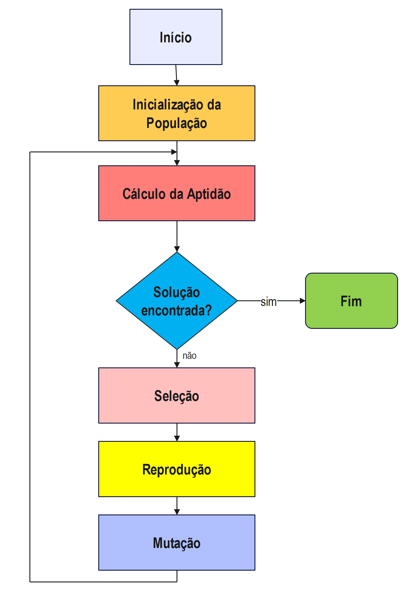
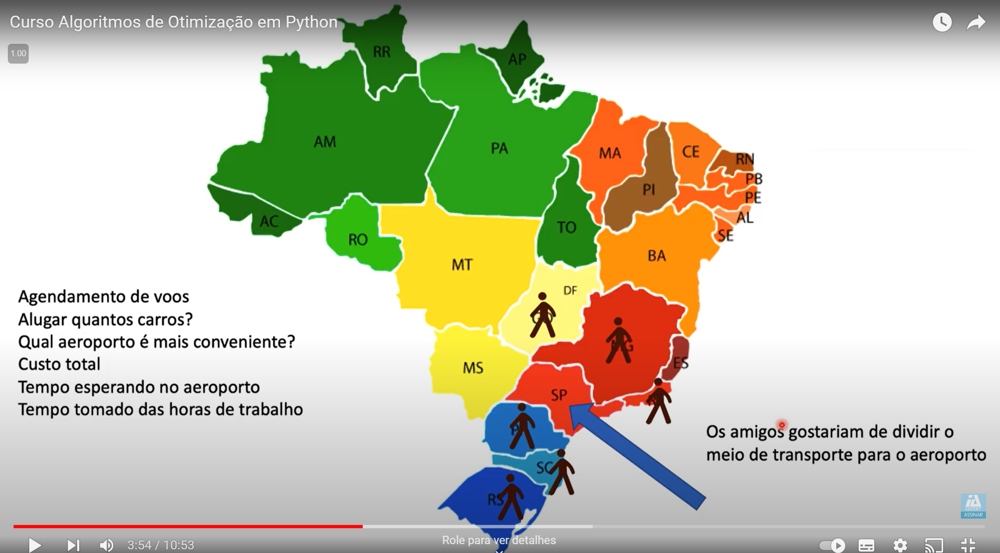

# Aula 5

# Considerações Iniciais

Os algoritmos genéticos são uma família de modelos computacionais
inspirados na evolução, que incorporam uma solução potencial para um
problema específico numa estrutura semelhante a de um cromossomo e
aplicam operadores de seleção e “cross-over” a essas estruturas de forma
a preservar informações críticas relativas à solução do problema.

# Algoritmo genético - conceitos

Vantagens do AG: simplificação na formulação e solução de problemas de
otimização e trabalham com descrições de entrada formadas por cadeias de
bits de tamanho fixo. Alguns tipos de AG’s podem trabalhar com cadeias
de bits de tamanho variável, por exemplo AG’s usados para Programação
Genética.

Possuem um paralelismo implícito decorrente da avaliação independente de
cada uma dessas cadeias de bits, assim pode-se avaliar a viabilidade de
um conjunto de parâmetros para a solução do problema de otimização.

Os AG’s são numericamente robustos, ou seja, não são sensíveis a erros
de arredondamento no que se refere aos seus resultados finais

Vantagens do AG: simplificação na formulação e solução de problemas de
otimização e trabalham com descrições de entrada formadas por cadeias de
bits de tamanho fixo. Alguns tipos de AG’s podem trabalhar com cadeias
de bits de tamanho variável, por exemplo AG’s usados para Programação
Genética.

Possuem um paralelismo implícito decorrente da avaliação independente de
cada uma dessas cadeias de bits, assim pode-se avaliar a viabilidade de
um conjunto de parâmetros para a solução do problema de otimização.

Os AG’s são numericamente robustos, ou seja, não são sensíveis a erros
de arredondamento no que se refere aos seus resultados finais

# Algoritmos genéticos - terminologia

- Crossomos (genótipo)
- - Cadeia de bits que representa uma solução para o problema
- Gene
- - Representação de cada parâmetro de acordo com o alfabeto utilizado
    (binário, inteiro ou real)
- Fenótipo
- - Cromossomo codificado
- População
- - Conjunto de pontos (indivíduos) no Espaço de Busc
- Geração
- - Iteração completa do AG que gera uma nova população
- Aptidão bruta
- - Saída gerada pela função objetivo para um indivíduo da população
- Aptidão normalizada
- - Aptidão bruta normalizada para entrada no algoritmo de seleção
- Aptidão máxima
- - Melhor indivíduo da população corrente
- Aptidão média
- - Aptidão média da população corrente

# Funcionamento

# Implementação

