# Aula 6 - Conceito de Machine Learning e TinyML

# Ecossistema de Inteligência Artificial

Artificial Intelligence: qualquer técnica que possibilite aos
computadores imitar o comportamento humano

Machine Learnig: Capacidade de aprender sem ser explicitamente
programado

Deep Learning: Extrai padrões de dados usando redes neurais

 

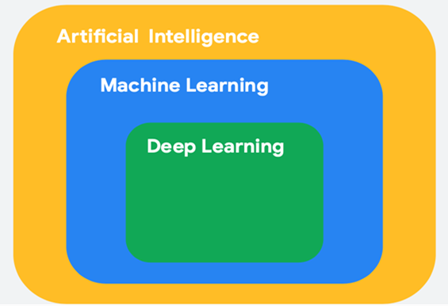

  Edge AI (or Edge ML) é o processamento de algoritmos de
Inteligência Artificial na borda (edge), ou seja, nos dispositivos dos
usuários. O conceito deriva da Computação de borda (Edge Computing), que
parte da mesma premissa: os dados são armazenados, processados e
gerenciados diretamente nos dispositivos finais da Internet das Coisas
(IoT).

TinyML é um subconjunto da EdgeML, onde os sensores estão gerando os
dados com baixo consumo de energia (baterias), possibilitando a
implantação do aprendizado de máquina continuamente (“sempre nos
dispositivos”)

  

# Conceito de Machine Learning

## O que é Aprendizado de Máquina?

1.  Aprendizado de Máquina é um subcampo da Inteligência Artificial
    focado no desenvolvimento de algoritmos que aprendem a resolver
    problemas analisando dados para padrões.

  

## Conceito de Deep Learning

2.  Deep Learning é um tipo de Aprendizado de Máquina que aproveita
    Redes Neurais e Big Data

 

# Aplicações de Machine Learning

- Classificação ou Detectação em imagens e vídeos
- Transcrição de Áudio
- Recomendações

# Classificação de Imagem

# Detecção de Objeto

# Segmentação

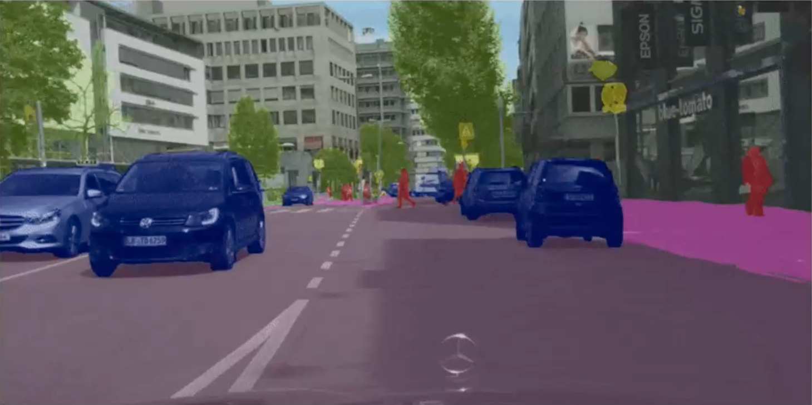

# Estimativa de pose

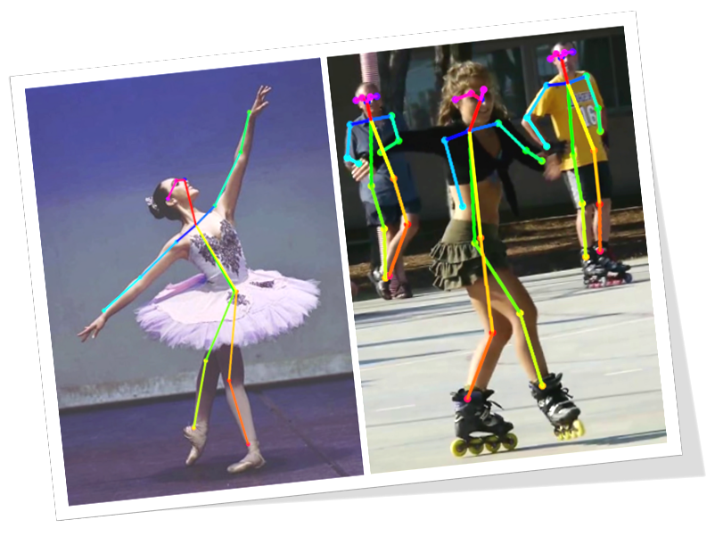

# Máquina de tradução de idioma

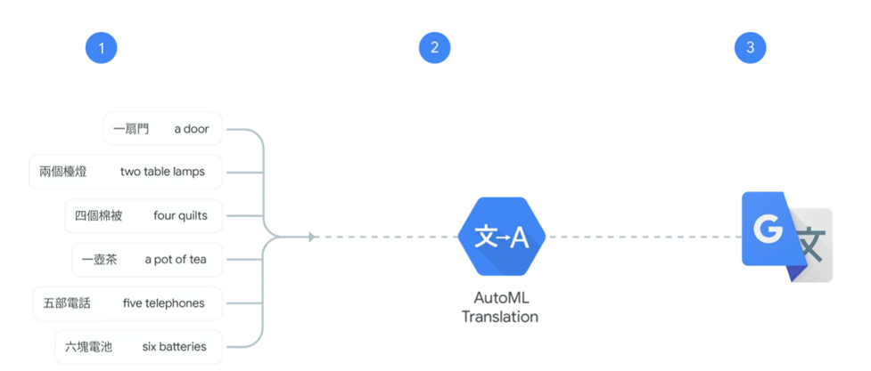

# Recomendações

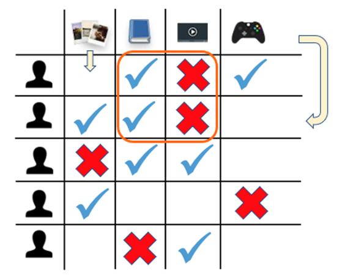

Todos os recursos dos exemplos anteriores exigiam uma grande quantidade
de energia e recursos de computação. As empresas estão colocando todos
esses computadores em data centers, e dedicados apenas para fornecer
recursos de aprendizado de máquina.

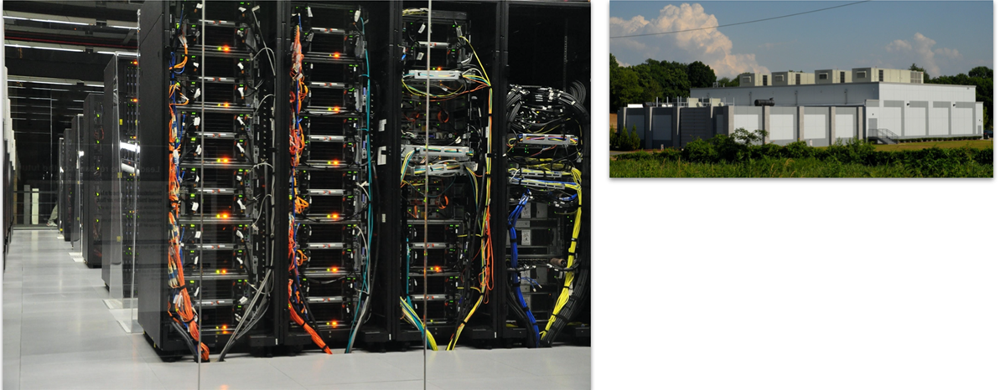

Para poder fornecer capacidade de ML, empresas como o Google estão
criando TPUs (Tensor Processing Units) e GPUs NVIDIA (Graphics
Processing Units). Ambos os sistemas de computação são capazes de
executar aprendizado de máquina extremamente rápido.

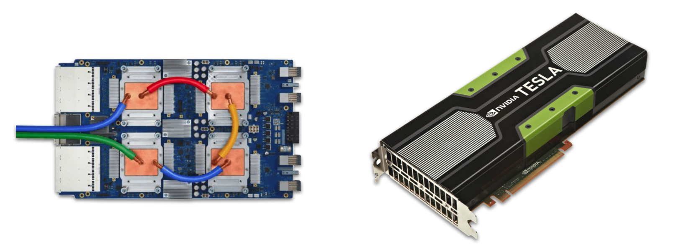

# Maior não é sempre o melhor

Dispositivos menores com operação decentralizada conseguem operar
utilizando menos energia, com uma menor largura de banda e obter menor
latência.

Os smartphones conseguiriam suprir a necessidade de ser um dispositivo
desse gênero, entretanto dispositivos especializados são comumente
utilizados por apresentarem maiores benefícios como por exemplo a Alexa.

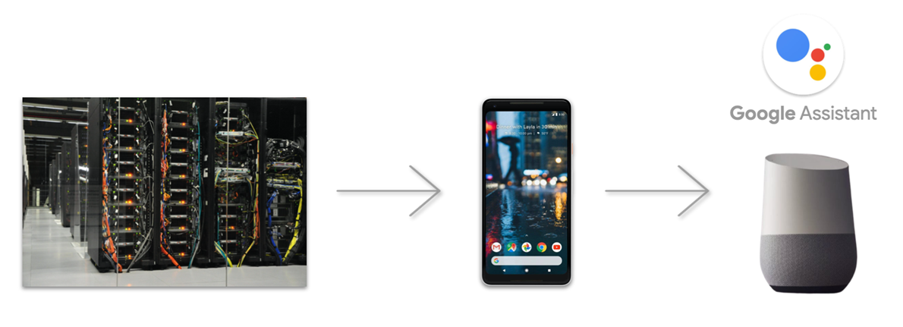

A partir de um dispositivo conectado outros dispositivos paralelos são
integrados de forma wireless como smartwatchs, fones, luzes e etc.

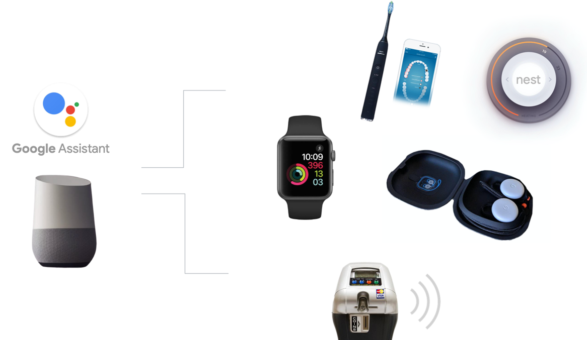

# O que é TinyML

TinyML é uma das áreas de maior crescimento de Machine Learning, a ideia
é criar modelos de Machine Learning capazes de operar em sistemas
embarcados, devido as limitações de processamento desses dispositivos os
modelos não podem ser computacionalmente custosos, para isso bibliotecas
como o Tensor Flow Lite são utilizadas para criar modelos de TinyML  

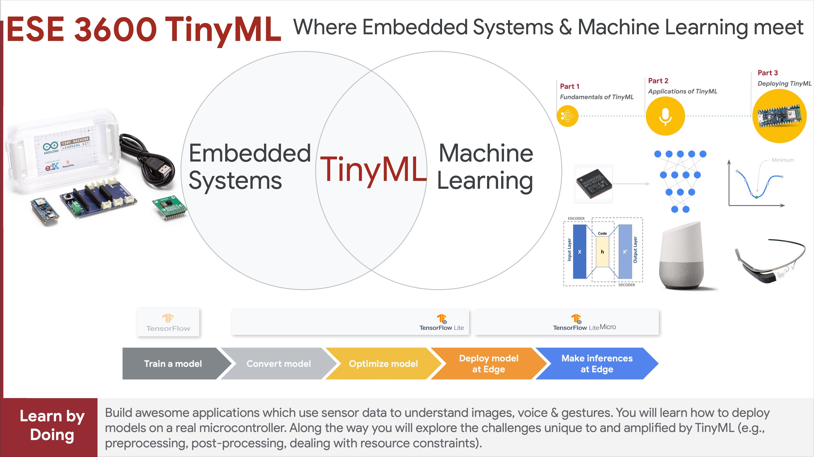

 

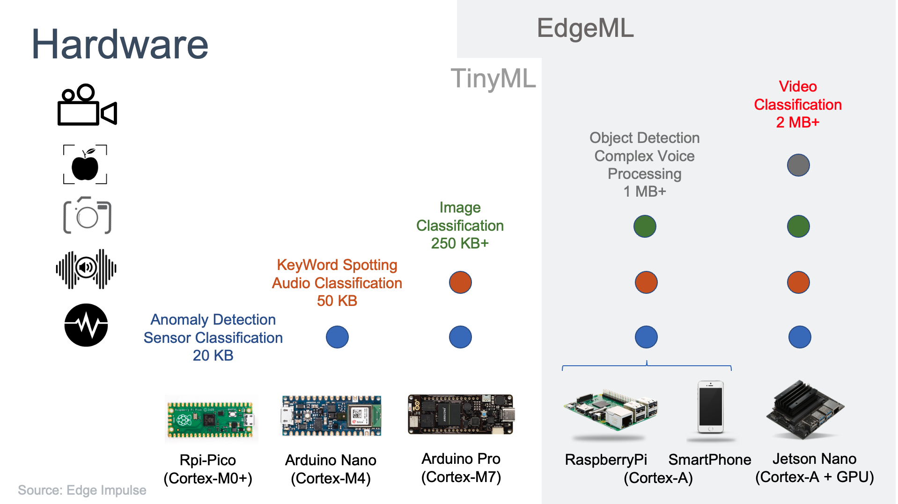

# Aplicações de Tiny Machine Learning (TinyML)

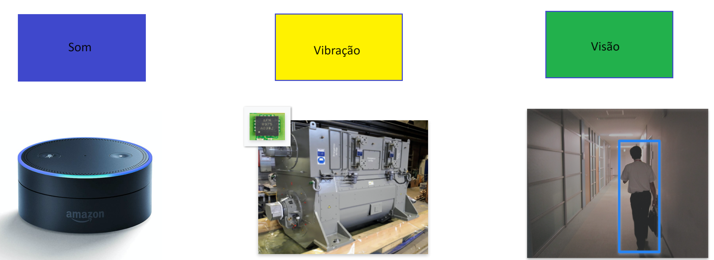

 

# Aplicações de Tiny Machine Learning

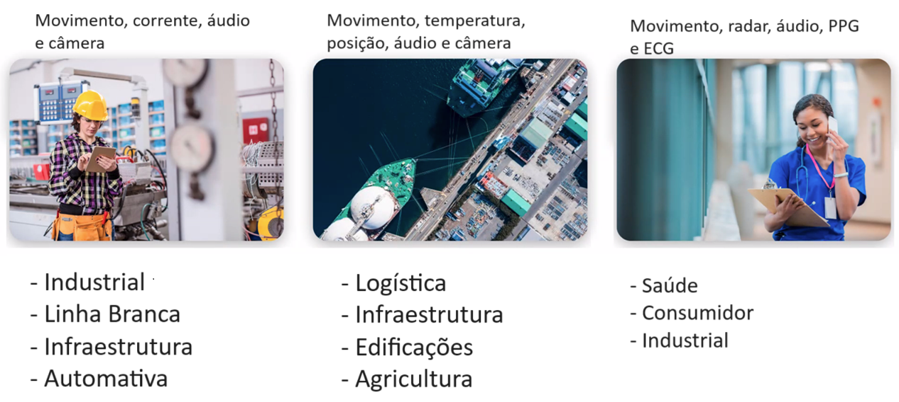

 

# Aplicações industriais de Tiny Machine Learning

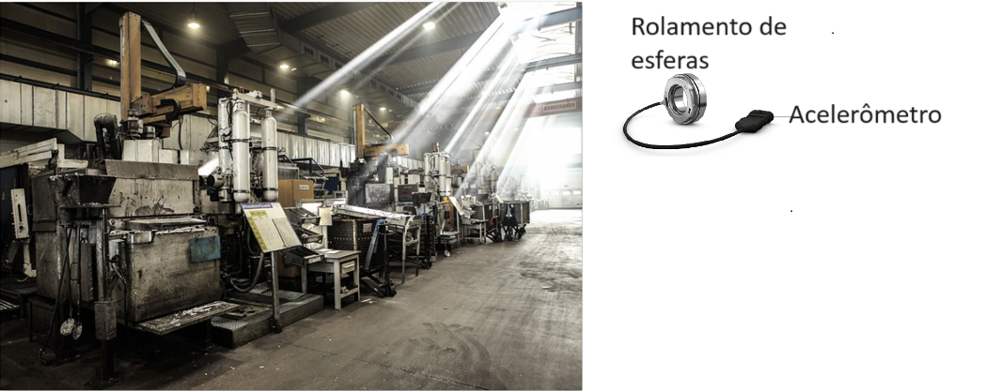

 

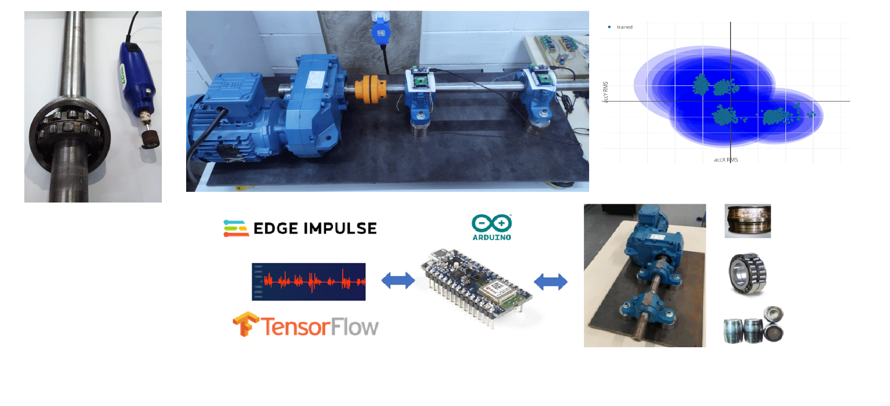

# Aplicações na agricultura de Tiny Machine Learning

## Clasificação de doenças no café

[Clique aqui para acessar o
paper](https://www.hackster.io/Yukio/coffee-disease-classification-with-ml-b0a3fc)

## Detecção de incêndios florestais

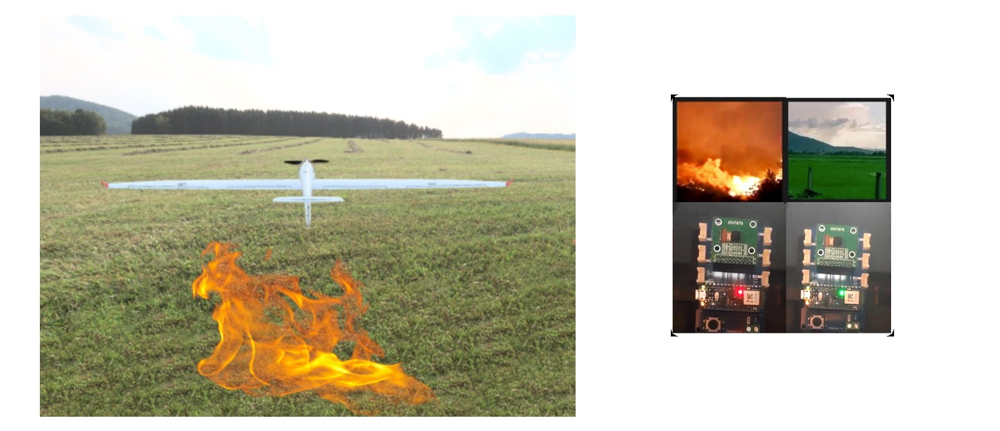

[TinyML Detecção Aérea de Incêndios
Florestais](https://www.hackster.io/team-sol/tinyml-aerial-forest-fire-detection-78ec6b)

[IESTI01 – Detecção de Incêndio Florestal – Prova de
Conceito](https://github.com/Mjrovai/UNIFEI-IESTI01-T01-2021.1/blob/main/00_Curso_Folder/2_Applications/Group_Projects-Final%20Reports/Projeto_final_Fire_detection/trabalho_final_Fire_Detection.pdf)

# Aplicações na saúde de Tiny Machine Learning

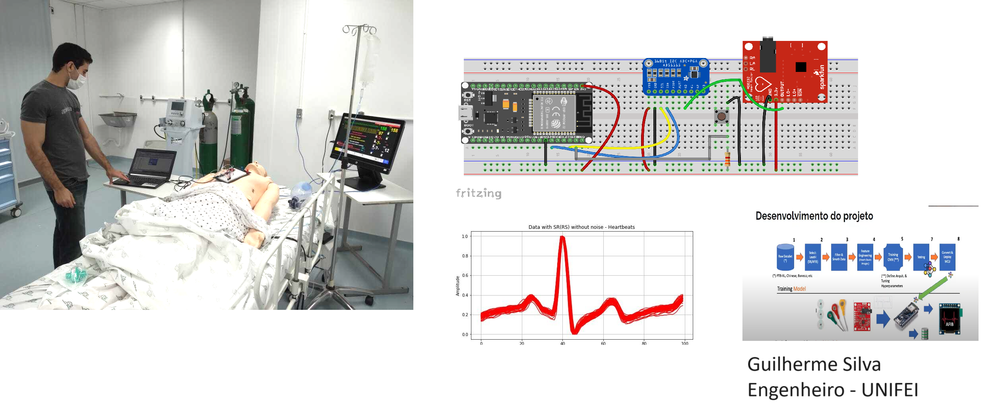

[Atrial Fibrillation Detection on ECG using TinyML Silva et al. UNIFEI
2021](https://github.com/Gui7621/TFG-AFIB_and_SR_detection_using_ML_in_embedded_systems)

# Habilitando TinyML

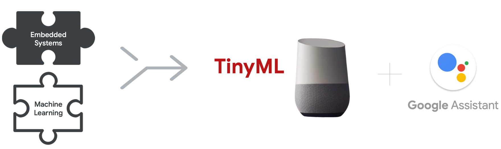

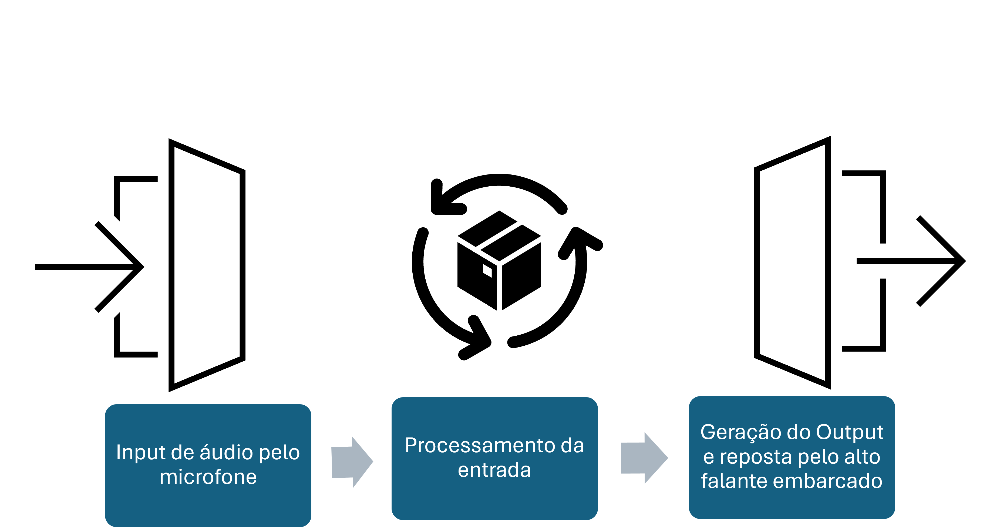

# Endpoints tem sensores …… Toneladas de sensores

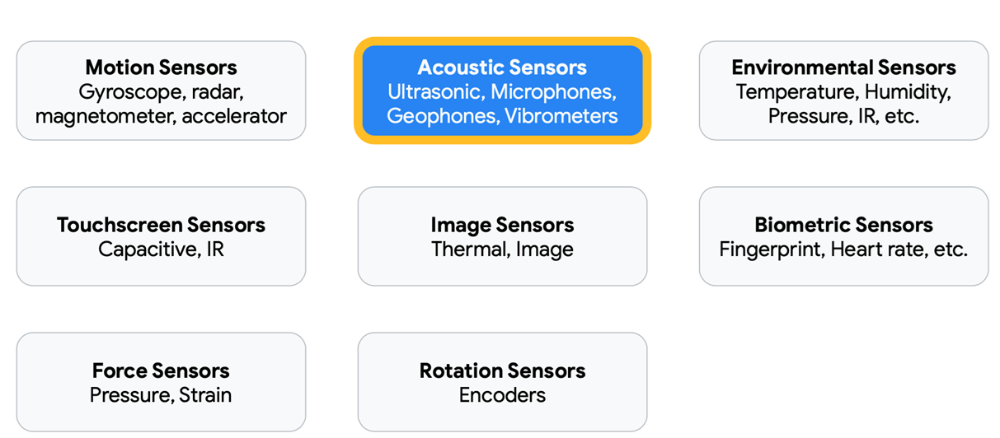

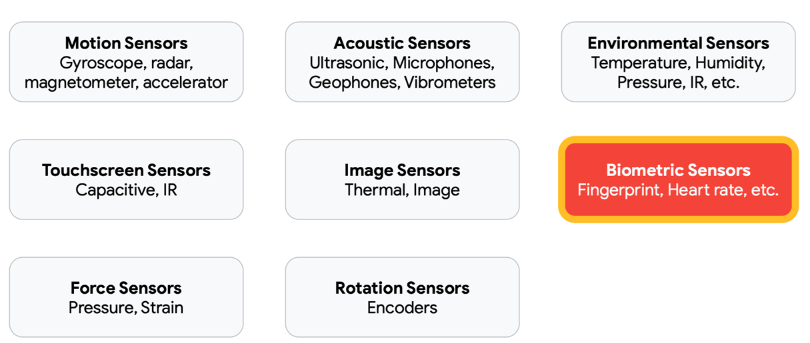

# Sensores Biométricos

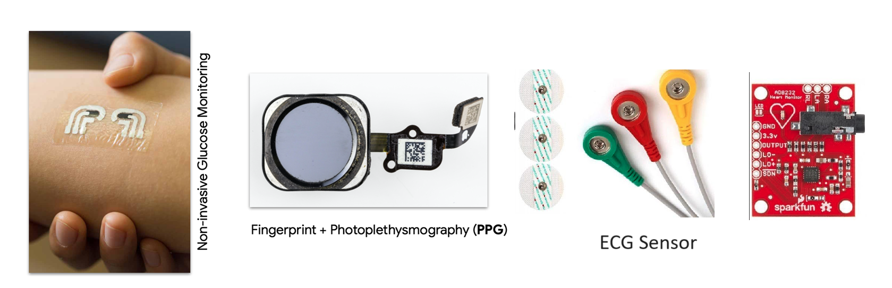

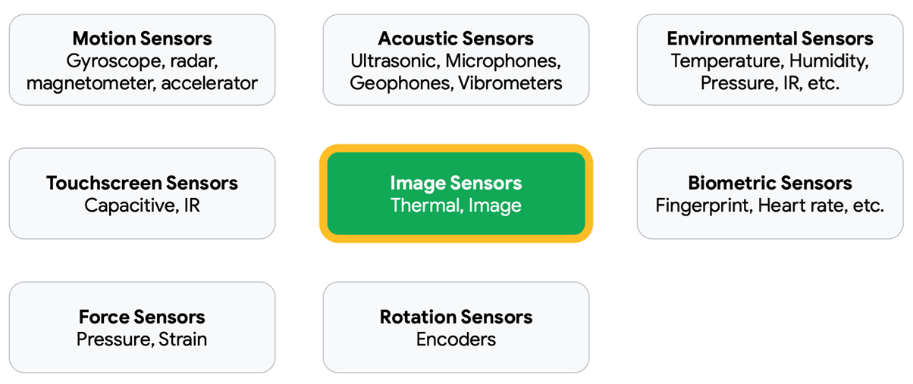

# Nano 33 BLE SENSE & OV7675 Camera

- Sensor de cor, brilho, proximidade e gestos

- Microfone Digital

- Movimento, vibração e sensor de orientação

- Sensor de Temperatura, umidade e pressão

- Microcontrolador Arm Cortex-M4 e módulo BLE

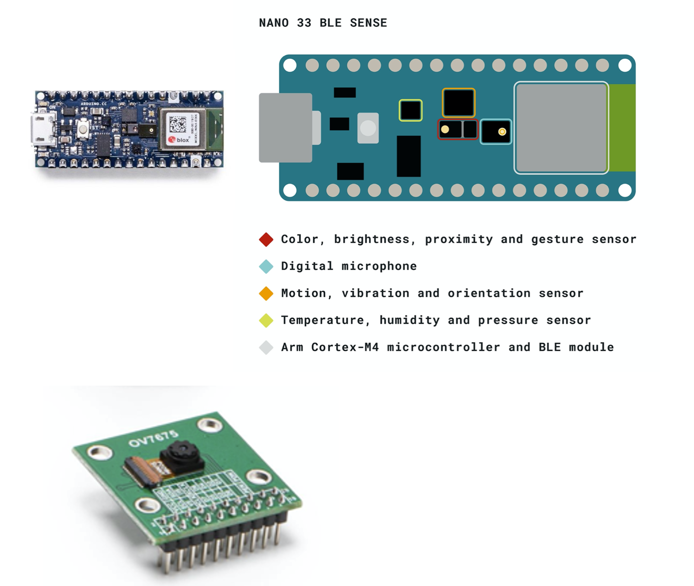
